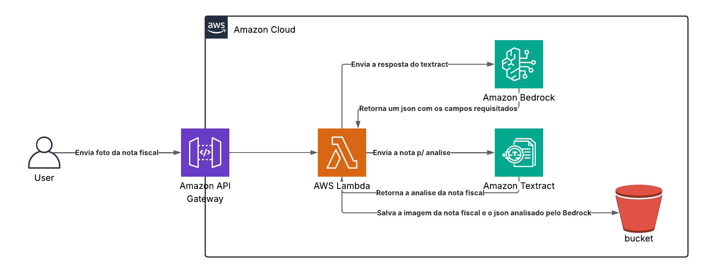

# 📊 Avaliação das Sprints 4, 5 e 6  
**Programa de Bolsas Compass UOL / AWS — Turma Março/2025**


---

## 🧾 Processamento de Notas Fiscais

Este projeto tem como objetivo o desenvolvimento de uma aplicação baseada em **Python** para o **processamento automatizado de Notas Fiscais Eletrônicas**, utilizando a **Amazon Web Services (AWS)** para garantir escalabilidade e eficiência.

O sistema é capaz de receber, processar e armazenar notas fiscais digitais, extraindo informações relevantes com serviços como **Textract** e **Bedrock**.

---

## 🚧 Desenvolvimento do Projeto

Utilizamos o **Jira** como ferramenta de gerenciamento de tarefas e a metodologia **Scrum** para o desenvolvimento iterativo e incremental durante as sprints.

---

## 🏗️ Arquitetura do Sistema



---

## 🧰 Tecnologias Utilizadas

- Python 3.12  
- AWS Lambda  
- Amazon Textract  
- Amazon Bedrock  
- Amazon S3  
- Amazon API Gateway  
- AWS IAM  
- Lambda Layer (NLTK)  
- Scrum / Jira  

---

## 📁 Estrutura de Pastas
```
📁 sprints-4-5-6-pb-aws-marco/
├── 📁 lambda/ → Funções e lógica serverless (AWS Lambda)
  └── 📁 models/ → Modelos e estruturas de dados
  └── 📁 utils/ → Funções utilitárias auxiliares
```
---

## 🚀 Como Fazer o Deploy?

### ✅ Dependências

- Conta na AWS  
- Plano AWS Free Tier ou superior  
- Bucket S3  
- Lambda Layer com NLTK (`tokenize` & `corpus`)

### 🛠️ Criando o Lambda

#### 1. Acesse o Console da AWS

- Acesse: [https://console.aws.amazon.com](https://console.aws.amazon.com)  
- Vá em **Serviços** → **Lambda**

#### 2. Criar a função Lambda

- Clique em **“Criar função”**
- Selecione **"Criar do zero"**

#### 3. Configurar a função

- **Nome da função**: `minhaFuncaoLambda`  
- **Runtime**: `Python 3.12`  
- **Função de execução**:  
  - Se for a primeira vez, selecione **"Criar uma nova função com permissões básicas"**

> Isso criará um papel IAM com permissões básicas do CloudWatch (para logs).

#### 4. Criar a função

- Clique em **“Criar função”**

#### 5. Fazer upload do código

- Na aba **Código**, selecione:
  - 📦 **Origem do código** → **Fazer upload de .zip**
  - Faça upload do `.zip` obtido via GitHub

#### 6. Preparar o código

- Extraia os arquivos de dentro da pasta `lambda/`  
- Mova-os para a **raiz do `.zip`**  
- Remova pastas desnecessárias  
- Recompacte e envie novamente

#### 7. Editar o nome da bucket no código

- No arquivo `lambda_function.py`, altere:


#### 8. Salvar e implantar
- Clique em Deploy após editar o código.

#### 9. Aumentar o tempo de execução
- Vá para a aba Configurações

- Clique em Editar na seção "Tempo limite"

- Altere de 3 segundos (padrão) para 20 segundos (ou mais)

- Clique em Salvar

#### 10. Adicionar permissões (Política Inline)
- Vá até a aba Permissões da função Lambda

- Clique no nome do papel IAM (ex: lambda-role-xxxxxxxx)

- No console do IAM, vá até Políticas Inline

- Clique em Adicionar política inline

```json
{
  "Version": "2012-10-17",
  "Statement": [
    {
      "Sid": "VisualEditor0",
      "Effect": "Allow",
      "Action": [
        "s3:PutObject",
        "s3:GetObject"
      ],
      "Resource": "arn:aws:s3:::<sua-bucket>/*"
    },
    {
      "Sid": "VisualEditor1",
      "Effect": "Allow",
      "Action": [
        "textract:DetectDocumentText",
        "bedrock:InvokeModel"
      ],
      "Resource": "*"
    }
  ]
}
```

- Clique em Avançar

- Nomeie a política ex: LambdaInlinePolicy

- Clique em Criar política

  ---

## 🌐 Criando o API Gateway
- Acesse API Gateway

- Clique em Create API → API REST

- Nomeie a API (ex: ImageUploadAPI)

- Clique em Next até a integração

- Clique em Add Integration e selecione a função Lambda

- Configure a rota:

- Método: POST

- Caminho: /api/v1/invoice

- Clique em Next > Create

- Acesse o Integration Request da rota

- Adicione Mapping Templates:

- Content-Type: image/jpeg

- Template:
```json
{
  "content": "$input.body"
}
```

- Após isso, faça o deploy da API.

✅ API pronta para envio de imagens via POST.

---

## ⚡ Como usar a API

- URL da API:
  https://0ybnpqgh78.execute-api.us-east-1.amazonaws.com/notas/api/v1/invoice

- Método: POST

- Headers:
  Content-Type: image/jpeg ou image/png


📤 Corpo da Requisição

Envie a imagem da nota fiscal em formato JPEG ou PNG diretamente no corpo da requisição.

Resposta esperada pela API:
```json
{
    "nome_emissor": "La Nonna Di Lucca",
    "CNPJ_emissor": "12941343000130",
    "endereco_emissor": "Rua Galvota, 689, Moema, Sao Paulo - SP",
    "CNPJ_CPF_consumidor": "19044690868",
    "data_emissao": "04/11/2020",
    "numero_nota_fiscal": "293881",
    "serie_nota_fiscal": "36",
    "valor_total": "527.82",
    "forma_pgto": "cartao_credito"
}
```

---

## ⚠️ Obstáculos Encontrados
- Desafios na criação de Lambda Layers

- Problemas de hardware prejudicaram a participação ativa de um integrante (Gabriel Xavier)

- A criação e configuração do serviço da AWS API Gateway para conseguir enviar de maneira correta a imagem das notas fiscais como dados binários para a AWS Lambda

- O compartilhamento das configurações iguais para a equipe, o que gerou diferentes erros para os diferentes membros

- A configuração do prompt de comandos para a Nova Pro, que buscando a saída que atendesse todos os requisitos do projeto sem falta de elementos necessários, ou a presença de elementos indesejados na resposta se provou ser um desafio

---

## 📚 Referências
- Cursos da Udemy

- Auxílio do instrutor Vinicius

- Vídeos no YouTube

- Documentação oficial da AWS

---

## 👥 Integrantes da Equipe
<table> <tr> <td align="center"><a href="https://github.com/JeffSSC"><br /><sub><b>Jefferson Silva Caires</b></sub></a></td> <td align="center"><a href="https://github.com/Dr-Dix"><br /><sub><b>Gabriel Sandro dos Santos Dix</b></sub></a></td> <td align="center"><a href="https://github.com/HyanSousa"><br /><sub><b>Hyan Gabriel Sousa Santos</b></sub></a></td> <td align="center"><a href="https://github.com/GabrielXavier0220"><br /><sub><b>Gabriel dos Santos Xavier</b></sub></a></td> </tr> </table> 
